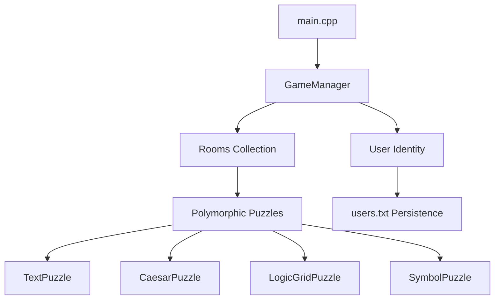

# 🏰 Digital Escape Room: A Modern OOP Adventure


A highly polished, console-based mystery game that demonstrates advanced **Object-Oriented Programming (OOP)**, **Cybersecurity best practices**, and **Modern C++ architecture**. Solve intricate puzzles, decrypt ancient codes, and navigate through immersive logic-based challenges to secure your escape.

---

## 🌟 Key Features

### 🧠 Advanced Architecture
- **Polymorphism in Action**: Utilizes abstract base classes and dynamic dispatch for a modular puzzle system (Text, Caesar Cipher, Logic Grids, Patterns).
- **Smart Resource Management**: Implements `std::unique_ptr` and **RAII** (Resource Acquisition Is Initialization) to ensure zero memory leaks and automatic lifecycle management.

### 🛡️ Cybersecurity & Data Integrity
- **Salted Hashing**: Implements the **FNV-1a algorithm** combined with **username-based salting** to protect user passwords against rainbow table attacks.
- **Masked Password Entry**: Secure console input masking (`******`) prevents shoulder surfing and sensitive data leaks during the login flow.
- **Input Sanitization**: Built-in validation to prevent database corruption from special character injections.
- **Persistence**: Reliable account management via a standardized flat-file database system (`users.txt`).

### 🎮 Premium CLI Experience
- **Interactive Feedback**: Uses the Windows Console API for color-coded status updates (Success, Error, Narrative).
- **Graceful Error Handling**: Comprehensive validation for inputs, lengths, and reserved characters.

---

## 📂 Project Structure

| File | Description |
| :--- | :--- |
| `main.cpp` | Core entry point; orchestrates game initialization. |
| `gamemanager.h/cpp` | The engine of the game; manages rooms, flow control, and UI rendering. |
| `user.h/cpp` | The identity layer; handles authentication, salting, and progress persistence. |
| `puzzle.h` | The logic library; contains polymorphic puzzle definitions. |
| `users.txt` | The persistent storage layer (Securely hashed). |

---

## 🛠️ How to Build & Run

### Prerequisites
- **Compiler**: A standard C++17 compliant compiler (GCC/Clang or MSVC).
- **OS**: Windows (optimized for Windows Console API).

### Using G++
```bash
g++ main.cpp gamemanager.cpp user.cpp -o escape_room
./escape_room
```

### Using Visual Studio
1. Open `OOP PROJECT.sln`.
2. Ensure **x64** is selected as the platform.
3. Press **F5** to build and run.

---

## 🏗️ Architecture Design



---

## 📜 License
This project is licensed under the **MIT License** - see the [LICENSE](LICENSE) file for details.

*Developed as a definitive capstone for the 2nd Semester OOP Project.* 
